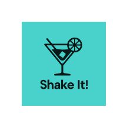

# 

**Shake It!** ist eine einfache App, die dir Cocktail-Rezepte vorschlägt – direkt aus der [TheCocktailDB API](https://www.thecocktaildb.com/api.php).

## Funktionen

- Cocktails nach Namen oder Zutat suchen
- Zufälligen Drink anzeigen lassen
- Bilder der Zutaten anzeigen
- Details zu jedem Cocktail (Zutaten, Zubereitung, Bild)

## Verwendete API

TheCocktailDB REST API – Beispiele:

- Suche nach Name: `search.php?s=margarita`
- Filter nach Zutat: `filter.php?i=Gin`
- Zufälliger Drink: `random.php`

Zutatenbilder:
```
https://www.thecocktaildb.com/images/ingredients/<ZUTAT>-Small.png
```

Beispiel: `Vodka` →  
`https://www.thecocktaildb.com/images/ingredients/Vodka-Small.png`

## Entwickelt von

- **Sebastian Dendtler**
- **Stefan Moldoveanu**
